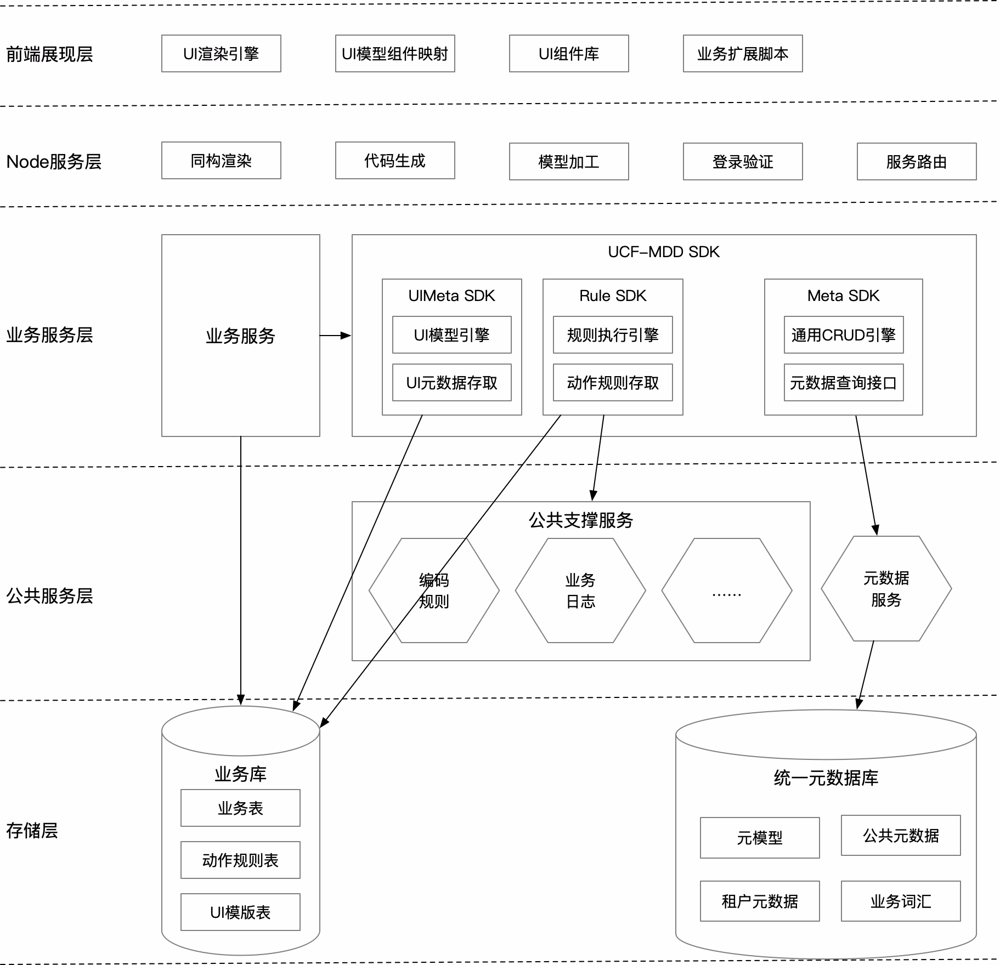
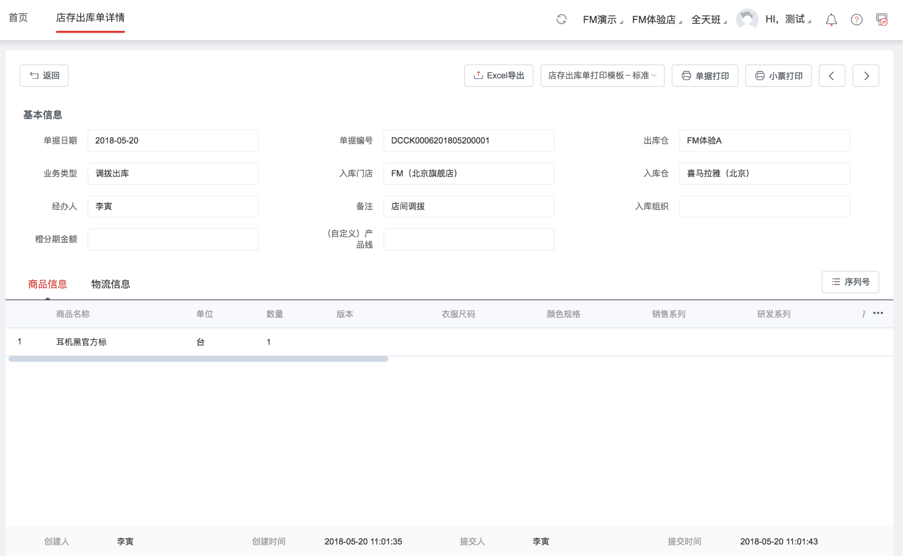

## 完整方案




## 参考资料

- 1、组件模型定义文档：https://www.yuque.com/gpgy5k/ucf/ikpq0g
- 2、U8C 模型框架文档：https://www.showdoc.cc/web/#/89974793848004?page_id=511175388158099
- 3、原UI模板渲染引擎实现：http://git.yonyou.com/litongf/new-template/tree/master

## 验证场景（单表型参照）

### 效果示例



### Mock 接口

对应的Mock平台地址：https://mock.yonyoucloud.com/project/717/interface/api/3902

### 接口详情

在标准接口协议基础上有一定的简单封装，实现的时候需要考虑扩展性，做一下判断：

- 如果是参m照协议解析，做简单处理，gridMeta中的解析再继续走标准协议解析
- 如果是标准协议解析，走标准解析。

```
{
  "code": 200,
  "message": "操作成功",
  "data": {
    "refEntity": {
      "id": 1000002,
      "code": "dept",
      "name": "部门",
      "description": "部门",
      "refType": "dept",
      "isOrgRel": false,
      "datasourceType": "meta",
      "cBillnum": "deptref",
      "cSub_ID": "AA",
      "cTpltype": "Table",
      "bMultiSel": false,
      "cRefFilterSql": "0",
      "bAuth": false,
      "cCheckFlds": "code,fullname",
      "bPage": false,
      "cDataGrid_FullName": "aa.dept.Department",
      "bDataClass_Rule": false,
      "bDataClass_RetEndData": false
    },
    "gridMeta": {
      "viewmodel": {
        "iBillId": 1001283066,
        "cBillName": "部门参照",
        "cBillNo": "deptref",
        "cBillType": "Archive",
        "cSubId": "AA",
        "bBatchOperate": true,
        "entities": [
          {
            "cCode": "deptref",
            "cEntityName": "部门信息",
            "cType": "Bill",
            "cDataSourceName": "aa.dept.Department",
            "cPrimaryKey": "id",
            "iBillEntityId": 2163427,
            "bMain": true,
            "cControlType": "Table",
            "fields": [
              {
                "cFieldName": "code",
                "cItemName": "code",
                "cCaption": "编码",
                "cShowCaption": "编码",
                "iBillEntityId": 2163427,
                "iBillTplGroupId": 69417689,
                "iTplId": 1338385,
                "iMaxLength": 255,
                "iFieldType": 1,
                "bEnum": false,
                "bMustSelect": false,
                "bHidden": false,
                "bCanModify": true,
                "iMaxShowLen": 255,
                "iColWidth": 150,
                "bShowIt": true,
                "bFilter": true,
                "bIsNull": false,
                "cTplGroupName": "Table",
                "bMain": true,
                "cDataSourceName": "aa.dept.Department",
                "cControlType": "Input",
                "bVmExclude": 0,
                "iOrder": 1,
                "isshoprelated": false,
                "iSystem": 1,
                "authLevel": 3
              },
              {
                "cFieldName": "name",
                "cItemName": "name",
                "cCaption": "简称",
                "cShowCaption": "简称",
                "iBillEntityId": 2163427,
                "iBillTplGroupId": 69417689,
                "iTplId": 1338385,
                "iMaxLength": 255,
                "iFieldType": 1,
                "bEnum": false,
                "bMustSelect": false,
                "bHidden": false,
                "bCanModify": true,
                "iMaxShowLen": 255,
                "iColWidth": 150,
                "bShowIt": true,
                "bFilter": true,
                "bIsNull": false,
                "cTplGroupName": "Table",
                "bMain": true,
                "cDataSourceName": "aa.dept.Department",
                "cControlType": "Input",
                "bVmExclude": 0,
                "iOrder": 1,
                "isshoprelated": false,
                "iSystem": 1,
                "authLevel": 3
              },
              {
                "cFieldName": "id",
                "cItemName": "id",
                "cCaption": "id",
                "cShowCaption": "id",
                "iBillEntityId": 2163427,
                "iBillTplGroupId": 69417689,
                "iTplId": 1338385,
                "iFieldType": 1,
                "bEnum": false,
                "bMustSelect": true,
                "bHidden": true,
                "bCanModify": true,
                "iMaxShowLen": 255,
                "iColWidth": 100,
                "bNeedSum": false,
                "bShowIt": true,
                "bFilter": false,
                "bIsNull": true,
                "bPrintCaption": true,
                "bJointQuery": false,
                "bPrintUpCase": false,
                "cTplGroupName": "Table",
                "bMain": true,
                "cDataSourceName": "aa.dept.Department",
                "cControlType": "Input",
                "bVmExclude": 0,
                "iOrder": 7,
                "isshoprelated": false,
                "iSystem": 1,
                "authLevel": 3
              }
            ]
          }
        ],
        "actions": []
      },
      "viewApplication": {
        "billid": 1001283066,
        "cBillName": "部门参照",
        "cBillType": "Archive",
        "cBillNo": "deptref",
        "bAllowMultiTpl": false,
        "cSubId": "AA",
        "cCardKey": "dept",
        "view": {
          "iTplId": 1338385,
          "cTemplateName": "部门信息显示模板(编辑态)",
          "iTplMode": 2,
          "iWidth": 10000,
          "cTemplateTitle": "部门信息",
          "containers": [
            {
              "groupId": 69417689,
              "cName": "Table",
              "iOrder": 0,
              "bMain": true,
              "cCode": "deptref",
              "cDataSourceName": "aa.dept.Department",
              "cControlType": "Table",
              "cGroupCode": "Table",
              "cAlign": "top",
              "iCols": 0,
              "controls": [
                {
                  "cItemName": "code",
                  "cCaption": "编码",
                  "cShowCaption": "编码",
                  "iMaxLength": 255,
                  "iFieldType": 1,
                  "bEnum": false,
                  "bMustSelect": false,
                  "bHidden": false,
                  "bCanModify": true,
                  "iMaxShowLen": 255,
                  "iColWidth": 150,
                  "bShowIt": true,
                  "bFilter": true,
                  "iTabIndex": 0,
                  "bIsNull": false,
                  "cControlType": "Input",
                  "iOrder": 1,
                  "bMain": true,
                  "id": 71244758,
                  "bVmExclude": 0,
                  "iBillTplGroupId": 69417689,
                  "iBillId": 1001283066,
                  "iBillEntityId": 2163427,
                  "iTplId": 1338385,
                  "cSubId": "AA",
                  "iSystem": 1,
                  "cName": "code",
                  "cFieldName": "code",
                  "authLevel": 3,
                  "cDataSourceName": "aa.dept.Department",
                  "enterDirection": 4
                },
                {
                  "cItemName": "name",
                  "cCaption": "简称",
                  "cShowCaption": "简称",
                  "iMaxLength": 255,
                  "iFieldType": 1,
                  "bEnum": false,
                  "bMustSelect": false,
                  "bHidden": false,
                  "bCanModify": true,
                  "iMaxShowLen": 255,
                  "iColWidth": 150,
                  "bShowIt": true,
                  "bFilter": true,
                  "iTabIndex": 0,
                  "bIsNull": false,
                  "cControlType": "Input",
                  "iOrder": 1,
                  "bMain": true,
                  "id": 71244759,
                  "bVmExclude": 0,
                  "iBillTplGroupId": 69417689,
                  "iBillId": 1001283066,
                  "iBillEntityId": 2163427,
                  "iTplId": 1338385,
                  "cSubId": "AA",
                  "iSystem": 1,
                  "cName": "name",
                  "cFieldName": "name",
                  "authLevel": 3,
                  "cDataSourceName": "aa.dept.Department",
                  "enterDirection": 4
                }
              ]
            }
          ]
        },
        "extscripturls": []
      }
    }
  }
}
```