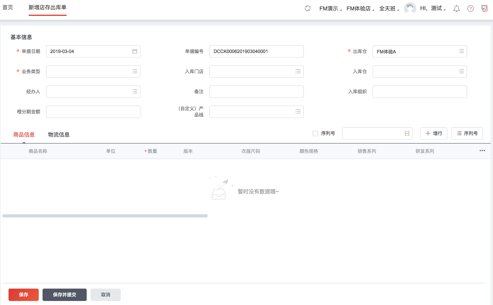

## 完整方案架构

其中前端展现层就是我们要做的事情。

## 资料

- 1、组件模型定义文档：https://www.yuque.com/gpgy5k/ucf/ikpq0g
- 2、模型框架文档：https://www.showdoc.cc/web/#/89974793848004?page_id=511175388158099
- 3、店存出库单协议接口：http://mdf-test.test.app.yyuap.com/mdf/billmeta/getbill?billno=st_storeout&bIncludeViewModel=true&token=31d0ec66df5045d4a6cba75af31d11fa&terminalType=1
 
（对应的Mock平台地址：https://mock.yonyoucloud.com/mock/717/bill）

- 4、ui 模板渲染引擎：http://git.yonyou.com/litongf/new-template/tree/master

## 验证场景

详情展示态：

新增态：

